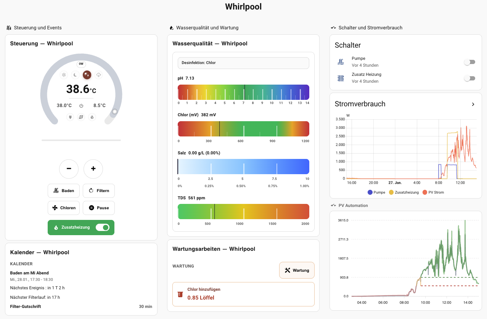

# Pool Controller - Erweiterte Home-Assistant-Integration

Sprache: [English](README.md) | **Deutsch**

## Überblick

**Pool Controller** ist eine Home-Assistant-Custom-Integration zur Steuerung und Automatisierung deines Whirlpools oder Pools, wenn das Gerät selbst keine integrierten Smart-Funktionen bietet.

Wenn dein Whirlpool oder Pool nur an einem einfachen Smart Switch hängt, also nur ein oder ausgeschaltet werden kann, fehlen wichtige Automationsfunktionen wie Filterzyklen, Temperaturregelung, Frostschutz oder Wasserqualitätsüberwachung. **Pool Controller** bringt diese Funktionen zurück und ergänzt zusätzlichen Komfort sowie Effizienzfunktionen.

## Vorschau der Dashboard-Karte

> Die oben gezeigte Dashboard-Karte ist als separates HACS-Plugin verfügbar: [lweberru/pool_controller_dashboard_frontend](https://github.com/lweberru/pool_controller_dashboard_frontend)

## Dokumentation

Die Dokumentation in diesem Repository ist in Kapitel aufgeteilt, damit die Navigation übersichtlich bleibt:

Englische Version: [README.md](README.md)

- [Installation & Einrichtung](docs/de/installation.md)
- [Konfiguration](docs/de/configuration.md)
- [Sensoren, Entitäten & Steuerung](docs/de/entities.md)
- [Kosten & Strompreise](docs/de/costs.md)
- [Aktionen und Services](docs/de/services.md)
- [Wasserqualität & Desinfektion](docs/de/water-quality.md)
- [Erweiterte Funktionen](docs/de/advanced.md)
- [Typische Automationen](docs/de/automations.md)
- [Fehlersuche](docs/de/troubleshooting.md)

## Mitwirken

Entwicklungsregeln und Release-Workflow für HACS über GitHub Releases findest du in [CONTRIBUTING.md](CONTRIBUTING.md).

## Changelog

Die Versionshistorie steht in [CHANGELOG.md](CHANGELOG.md).