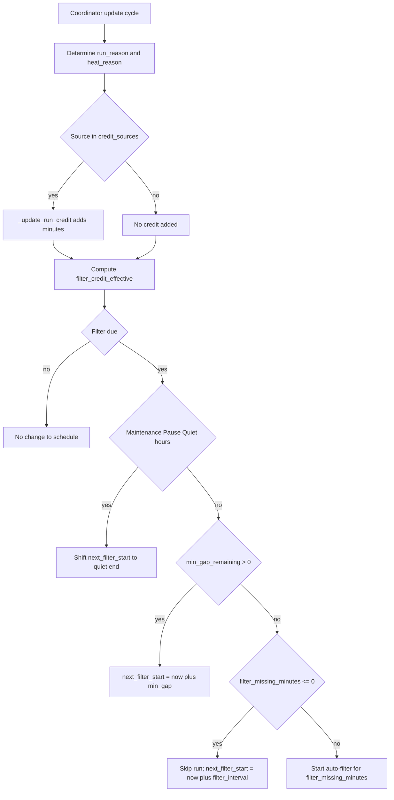

# Advanced Features

[← Back to README](../README.md)

## Filtration Logic
- **Auto-filtering**: Runs on configurable interval
- **Smart scheduling**: Respects quiet hours and frost danger
- **Manual override**: Start/stop via buttons or services
- **Duration control**: Adjustable per cycle
- **Run credit**: Minutes already run can reduce or shift future runs
- **Merge window**: When a frost run is close, filter + frost can merge into a single run
- **Minimum gap**: Enforces a rest period between runs (except severe frost)

### Run Credit (Filter + Frost)

The controller tracks **eligible run minutes** (credit). If a recent run already covered part of the needed filter or frost time, the next run can be shortened or shifted.

- **Credit Sources** decide which run reasons count (e.g., `filter`, `bathing`, `chlorine`, `preheat`, `pv`, `frost`, `thermostat`).
- **Minimum Credit** ignores very short runs (noise).
- **Filter credit** reduces the *next* auto-filter duration (or skips it if fully covered).
- **Frost credit** can shift mild frost cycles later to reduce noise.

This improves efficiency by avoiding redundant runs while keeping protection targets intact.

#### Flow: How bathing/PV affects the next filter run



#### Example 1: PV run creates credit and skips the next filter

**Setup:**
- `filter_interval_minutes = 720` (12h)
- `filter_minutes = 30`
- `credit_sources` includes `pv`

**Scenario:**
1. The pool runs for **30 minutes** due to **PV surplus**.
2. Those minutes are added to `filter_credit_minutes`.
3. When the next filter time is reached, `filter_missing_minutes <= 0`.

**Result:** The filter run is skipped and `next_filter_start` is moved to **now + 12h**.

#### Example 2: Bathing run creates partial credit and shortens the next filter

**Setup:**
- `filter_interval_minutes = 720` (12h)
- `filter_minutes = 40`
- `credit_sources` includes `bathing`

**Scenario:**
1. A **20‑minute bathing session** runs.
2. Those minutes are counted as credit.
3. When the next filter time is reached, `filter_missing_minutes = 20`.

**Result:** The auto‑filter starts but runs for **20 minutes** instead of 40.

## Temperature Control & Water Volume Calculations

The **water volume** setting is critical for automated calculations.

### Heating Time Calculation (Adaptive)

The preheat calculation now uses an **effective heating power** that subtracts estimated heat loss and adds a learned startup offset.

**Effective heating power:**

```
P_eff (W) = max(1, P_base + P_aux*aux_enabled - heat_loss_w_per_c * ΔT_out)

Where:
- P_base = configured base power (e.g., pump waste heat)
- P_aux = configured auxiliary heater power
- aux_enabled = 1 if aux heating is enabled, else 0
- ΔT_out = max(0, water_temp - outdoor_temp)
```

**Heating time estimate:**

```
t_min (minutes) = (Water Volume (L) × 1.16 × ΔT (°C)) / P_eff (W) × 60
t_est (minutes) = round(t_min) + heat_startup_offset_minutes

Where:
- 1.16 = Specific heat capacity of water (Wh/L/°C)
- ΔT = Target temperature - Current water temperature (min 0)
```

### Adaptive Heating Tuning (Auto‑Learned)

Two diagnostic sensors expose the learned values:

- `sensor.<pool>_heat_loss_w_per_c` (W/°C)
- `sensor.<pool>_heat_startup_offset_minutes` (min)

**Heat loss coefficient (`heat_loss_w_per_c`)**
- Updated only while the pool is **off** (pump OFF, aux heater OFF).
- Uses at least **60 minutes** between samples to avoid zero‑delta from sparse sensor updates.
- Based on cooling rate and outdoor temperature delta.
- Smoothed with EMA (α = 0.2).

**Startup offset (`heat_startup_offset_minutes`)**
- Starts when heating becomes active.
- First measurable warming = water temp rises by **≥ 0.1 °C** over the start temperature.
- The measured delay (max 30 min) is smoothed with EMA (α = 0.2).

### Example (Concrete Numbers)

Assume:
- Water volume: **1100 L**
- Cooling rate: **0.1 °C/hour**
- Heating power: **850 W (base) + 2750 W (aux) = 3600 W**
- Outdoor delta: **ΔT_out = 10 °C** (example)
- Target delta: **ΔT = 5 °C** (example)
- Startup offset: **8 min** (example learned value)

**Loss power from cooling:**

```
loss_W = 1100 × 1.16 × 0.1 = 127.6 W
heat_loss_w_per_c = 127.6 / 10 = 12.76 W/°C
```

**Old formula (no loss, no offset):**

```
t_old = (1100 × 1.16 × 5) / 3600 × 60 ≈ 106.3 min
```

**New formula:**

```
P_eff = 3600 - (12.76 × 10) = 3472.4 W
t_new = (1100 × 1.16 × 5) / 3472.4 × 60 ≈ 110.2 min
t_est = 110.2 + 8 ≈ 118.2 min
```

### Temperature Control (Extended)

**Heating enabled when:**
- ✅ Pool not paused
- ✅ Not in frost protection mode
- ✅ Calendar preheat / bathing / PV surplus allows heating

## Calendar Events & Weather Guard

The integration can **preheat** before calendar events and start a **bathing session** while the event is ongoing.
If the **Weather Guard** is enabled, it checks the hourly forecast and **skips both preheat and event start** when rain is likely during the event.

**How it works:**
- The system reads the next/ongoing calendar event window.
- It fetches hourly forecast data via `weather.get_forecasts`.
- It calculates the **maximum rain probability** during the event.
- If that probability is **>= the configured threshold**, the event is blocked.

**Relevant entities:**
- `sensor.<pool>_event_rain_probability`
- `binary_sensor.<pool>_event_rain_blocked`

**Example:**

```yaml
# Settings (Options → Calendar step)
enable_event_weather_guard: true
event_weather_entity: weather.home
event_rain_probability: 60
```

## PV Solar Optimization

When connected to solar:
- Heating only engages if excess PV production > ON threshold
- Heating stops when excess drops below OFF threshold
- Maximizes self-consumption of solar energy

## Power-Saving Mode (Stromsparen)

Power-saving mode is a dedicated operating strategy for **cost-first** pool control.
It keeps safety/maintenance constraints intact (e.g., frost protection), but shifts normal runtime decisions toward lower-cost windows with better PV availability.

### How the mode works

- Activation: via climate preset (`Stromsparen`) or services (`start_power_saving` / `stop_power_saving`).
- Availability: only offered when required sensors/signals are available; it auto-disables if required input disappears.
- Runtime strategy:
	- Prioritize pump/heating stages when PV conditions are sufficient.
	- If an auto-filter run is due but PV is currently insufficient, the run can be deferred.
	- Deferred run is forced at/after the configured deadline hour (`power_saving_filter_deadline_hour`, default `16`).

### Power-Saving vs Auto mode

**Main advantage of Power-Saving mode:**
- Usually the **lowest net operating cost**, because runtime is shifted away from low-PV/high-grid-cost periods whenever possible.

**Main disadvantage vs Auto mode:**
- Runtime timing is less strict and can be deferred; this can reduce predictability compared to Auto mode, which follows regular scheduling more directly.
- Runtime can become longer in weak-PV periods, which may increase perceived pump noise duration.
- Depending on your hardware and temperature delta, heat-up in pump-first operation can be less efficient than using the auxiliary heater more aggressively.

### Practical estimation before enabling Power-Saving

Use a simple before/after estimate with your own measurements:

- Let `E_auto` be average daily pool energy in Auto mode (kWh/day).
- Let `PV_share_auto` and `PV_share_ps` be the average PV share of pool consumption in Auto vs Power-Saving (0..1).
- Let `p_grid` be your average grid price (`€/kWh`) and `p_feed` your feed-in tariff (`€/kWh`).

Approximate daily net operating cost:

```text
cost_net ≈ E × (p_grid - PV_share × (p_grid - p_feed))
```

Estimated daily savings of Power-Saving against Auto:

```text
savings_day ≈ cost_net_auto - cost_net_ps
```

For runtime/noise impact, compare measured runtime windows:

```text
runtime_increase_% ≈ (runtime_ps - runtime_auto) / runtime_auto × 100
```

Typical field tendency (site-dependent):
- Net cost: often lower with Power-Saving when PV share increases noticeably.
- Runtime duration: often higher on low-irradiance days due to deferred and stretched operation windows.

### When to use which mode

- Use **Power-Saving** when minimizing energy cost and maximizing PV self-consumption are top priority.
- Use **Auto** when you prefer steady, predictable timing behavior over maximum cost optimization.

## Quiet Hours

Prevents noisy operations during sensitive times:
- Weekday quiet hours and weekend quiet hours
- Holidays are treated like weekends
- Quiet hours are respected by frost protection by default; an optional emergency threshold can allow frost cycling in extreme cold

## Frost Protection

When outdoor temperature drops below the configured frost start temperature:
- ⚠️ `binary_sensor.<pool>_frost_danger` turns on (risk)
- ✅ Pump requests are duty-cycled via `binary_sensor.<pool>_frost_active`
- ✅ During quiet hours the duty-cycle stays off by default; it only overrides quiet hours if outdoor temperature is below the configured emergency threshold

### Next frost protection run (countdown)

For dashboards, the integration also exposes:

- `sensor.<pool>_next_frost_mins`: minutes until the next **frost protection duty-cycle run starts**.

Notes:
- This is a best-effort estimate (based on the configured duty-cycle interval and quiet hours).
- It is **not** a weather forecast (“next frost”); it only appears when frost protection conditions apply.

## Optional Features

### Auxiliary Heating
If you've added an extra heater (resistive, heat pump, etc.):
1. Configure a secondary smart switch entity during setup
2. Switch appears as `switch.pool_aux_allowed`
3. Controls whether the auxiliary heater is currently allowed (feature enable)

### Salt Water Chlorination
If your pool uses salt chlorination:
- Configure salt sensor from Blueriiot
- Integration tracks salt levels
- Helps maintain proper electrolysis conditions
