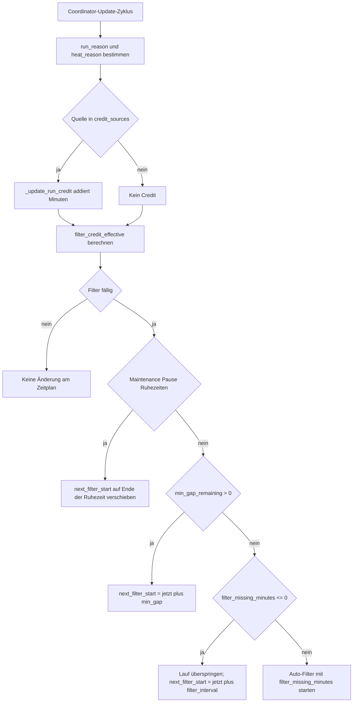

# Erweiterte Funktionen

[English](../advanced.md) | **Deutsch**

[← Zurück zur README](../../README.de.md)

## Filterlogik
- **Automatische Filterung**: Läuft in einem konfigurierbaren Intervall
- **Intelligente Planung**: Berücksichtigt Ruhezeiten und Frostgefahr
- **Manuelle Übersteuerung**: Start und Stopp per Button oder Service
- **Dauerkontrolle**: Pro Zyklus anpassbar
- **Run Credit**: Bereits gelaufene Minuten können spätere Läufe verkürzen oder verschieben
- **Merge Window**: Wenn ein Frostlauf nahe liegt, können Filter und Frost zu einem gemeinsamen Lauf zusammengeführt werden
- **Minimum Gap**: Erzwingt eine Pause zwischen Läufen, außer bei starkem Frost

### Run Credit für Filter und Frost

Der Controller verfolgt **anrechenbare Laufminuten** als Credit. Wenn ein aktueller oder kürzlich gelaufener Betrieb bereits einen Teil der benötigten Filter- oder Frostzeit abgedeckt hat, kann der nächste Lauf verkürzt oder nach hinten verschoben werden.

- **Credit Sources** bestimmen, welche Laufgründe als Credit zählen, z. B. `filter`, `bathing`, `chlorine`, `preheat`, `pv`, `frost`, `thermostat`.
- **Minimum Credit** ignoriert sehr kurze Läufe als Rauschen.
- **Filter-Credit** reduziert die Dauer des nächsten Auto-Filterlaufs oder überspringt ihn vollständig, wenn genug Zeit angerechnet wurde.
- **Frost-Credit** kann milde Frostzyklen nach hinten verschieben, um Lärm und unnötige Starts zu reduzieren.

Das verbessert die Effizienz, ohne Schutz- oder Hygieneziele aufzugeben.

#### Ablauf: Wie Baden oder PV den nächsten Filterlauf beeinflussen



#### Beispiel 1: PV-Lauf erzeugt genug Credit und überspringt den nächsten Filter

**Setup:**
- `filter_interval_minutes = 720` also 12 Stunden
- `filter_minutes = 30`
- `credit_sources` enthält `pv`

**Ablauf:**
1. Der Pool läuft **30 Minuten** wegen **PV-Überschuss**.
2. Diese Minuten werden zu `filter_credit_minutes` addiert.
3. Wenn der nächste Filterzeitpunkt erreicht wird, gilt `filter_missing_minutes <= 0`.

**Ergebnis:** Der Filterlauf wird übersprungen und `next_filter_start` wird auf **jetzt + 12 Stunden** gesetzt.

#### Beispiel 2: Badelauf erzeugt Teil-Credit und verkürzt den nächsten Filter

**Setup:**
- `filter_interval_minutes = 720` also 12 Stunden
- `filter_minutes = 40`
- `credit_sources` enthält `bathing`

**Ablauf:**
1. Eine **20-minütige Badesitzung** läuft.
2. Diese Minuten werden als Credit angerechnet.
3. Wenn der nächste Filterzeitpunkt erreicht wird, gilt `filter_missing_minutes = 20`.

**Ergebnis:** Der Auto-Filter startet, läuft aber nur **20 Minuten** statt 40.

## Temperaturregelung und Berechnungen mit Wasservolumen

Die Einstellung **Wasservolumen** ist zentral für automatische Berechnungen.

### Berechnung der Heizzeit (adaptiv)

Die Vorheizberechnung nutzt inzwischen eine **effektive Heizleistung**, die geschätzte Wärmeverluste abzieht und einen gelernten Startoffset addiert.

**Effektive Heizleistung:**

```text
P_eff (W) = max(1, P_base + P_aux*aux_enabled - heat_loss_w_per_c * ΔT_out)

Dabei gilt:
- P_base = konfigurierte Grundleistung, z. B. Abwärme oder Grundheizung
- P_aux = Leistung des Zusatzheizers
- aux_enabled = 1 wenn Zusatzheizung aktiv, sonst 0
- ΔT_out = max(0, water_temp - outdoor_temp)
```

**Heizzeitschätzung:**

```text
t_min (Minuten) = (Wasservolumen (L) × 1.16 × ΔT (°C)) / P_eff (W) × 60
t_est (Minuten) = round(t_min) + heat_startup_offset_minutes

Dabei gilt:
- 1.16 = spezifische Wärmekapazität von Wasser in Wh/L/°C
- ΔT = Zieltemperatur minus aktuelle Wassertemperatur, mindestens 0
```

### Adaptives Heiz-Tuning (automatisch gelernt)

Zwei Diagnose-Sensoren zeigen die gelernten Werte:

- `sensor.<pool>_heat_loss_w_per_c` in W/°C
- `sensor.<pool>_heat_startup_offset_minutes` in Minuten

**Wärmeverlustkoeffizient `heat_loss_w_per_c`**
- Wird nur gelernt, wenn der Pool **aus** ist, also Pumpe und Zusatzheizer aus.
- Verwendet mindestens **60 Minuten** zwischen Samples, damit einzelne Ausreißer nicht dominieren.
- Nutzt einen **robusten Online-Fit** über viele Samples statt eine Division aus nur einer Messung.
- Lernt nur aus plausiblen Abkühlphasen mit positiver Außentemperaturdifferenz.
- Nutzt einen leichten Forgetting-Faktor, damit alte saisonale Bedingungen langsam an Gewicht verlieren.
- Wird intern auf sinnvolle Bereiche begrenzt, damit Sensorausreißer nicht zu unbrauchbaren Werten führen.

**Startoffset `heat_startup_offset_minutes`**
- Beginnt, sobald Heizen aktiv wird.
- Erste messbare Erwärmung bedeutet mindestens **0,1 °C** über der Starttemperatur.
- Die gemessene Verzögerung bis maximal 30 Minuten wird mit EMA, also α = 0.2, geglättet.

### Beispiel mit konkreten Zahlen

Annahme:
- Wasservolumen: **1100 L**
- Abkühlrate: **0,1 °C pro Stunde**
- Heizleistung: **850 W Grundlast + 2750 W Zusatz = 3600 W**
- Außendifferenz: **ΔT_out = 10 °C**
- Zieldelta: **ΔT = 5 °C**
- Startoffset: **8 Min**

**Verlustleistung aus Abkühlung:**

```text
loss_W = 1100 × 1.16 × 0.1 = 127.6 W
single_sample_k = 127.6 / 10 = 12.76 W/°C
```

Im Betrieb verwendet der Controller diesen Einzelwert aber **nicht direkt**. `heat_loss_w_per_c` wird aus einem robusten Mehrfach-Sample-Fit gelernt, damit kurzzeitige Spitzen, etwa in warmen Sommernächten, nicht zu extremen Koeffizienten führen.

**Alte Formel ohne Verlust und ohne Offset:**

```text
t_old = (1100 × 1.16 × 5) / 3600 × 60 ≈ 106.3 min
```

**Neue Formel:**

```text
P_eff = 3600 - (12.76 × 10) = 3472.4 W
t_new = (1100 × 1.16 × 5) / 3472.4 × 60 ≈ 110.2 min
t_est = 110.2 + 8 ≈ 118.2 min
```

### Verhalten bei kleinem Temperaturdelta im Sommer

Wenn die Außentemperatur nahe an der Wassertemperatur liegt oder höher ist, wird eine direkte Division wie `loss / ΔT_out` numerisch instabil. Der robuste Fit vermeidet das, indem viele Samples zusammen bewertet und nach Signalstärke gewichtet werden.

### Praktischer Vergleich: Winter gegen Sommer

Die gleiche konfigurierte Heizleistung kann sich sehr unterschiedlich verhalten, je nach `ΔT_out`.

Annahme für beide Beispiele:
- Wasservolumen: **1000 L**
- Zielerwärmung jetzt: **ΔT = 4°C**
- `P_base + P_aux = 3500 W`
- Gelernter Startoffset: **6 Min**
- Gleicher gelernter Koeffizient `heat_loss_w_per_c = 9 W/°C`

#### Beispiel A: Kalte Winternacht

- Wasser: **34°C**
- Außen: **-2°C**
- `ΔT_out = 36°C`

```text
P_eff = 3500 - (9 * 36) = 3176 W
t_min = (1000 * 1.16 * 4) / 3176 * 60 = 87.7 min
t_est = 87.7 + 6 = 93.7 min
```

Interpretation: Im Winter hat der Verlustkoeffizient spürbaren Einfluss, weil Außenverluste hoch sind.

#### Beispiel B: Heißer Sommertag

- Wasser: **30°C**
- Außen: **31°C**
- `ΔT_out = max(0, 30 - 31) = 0°C`

```text
P_eff = 3500 - (9 * 0) = 3500 W
t_min = (1000 * 1.16 * 4) / 3500 * 60 = 79.5 min
t_est = 79.5 + 6 = 85.5 min
```

Interpretation: An sehr warmen Tagen ist der Verlustkoeffizient praktisch bedeutungslos, weil `ΔT_out` gegen 0 geht.

### Sonderfall: Sprunghafte Zielerhöhung bei Away OFF

Wenn der Away-Modus deaktiviert wird, kann die Zieltemperatur schnell stark ansteigen, z. B. von `25°C` zurück auf `38°C`. Dadurch steigt der Heizbedarf `ΔT = target - water_temp` deutlich und Vorheizen wirkt plötzlich dringend.

Beispiel:
- Aktuelles Wasser: **31°C**
- Ziel vor Away OFF: **25°C** also kein Heizbedarf
- Ziel nach Away OFF: **38°C** also `ΔT = 7°C`

Bei `P_eff = 3200 W` und Startoffset `6 Min` gilt:

```text
t_min = (1000 * 1.16 * 7) / 3200 * 60 = 152.3 min
t_est = 152.3 + 6 = 158.3 min
```

Interpretation: Das ist erwartetes Verhalten durch das größere Zieltemperaturdelta und kein Fehler im Heat-Loss-Lernen.

### Temperaturregelung erweitert

**Heizen ist aktivierbar, wenn:**
- der Pool nicht pausiert ist
- kein Frostschutzmodus aktiv ist
- Kalender-Vorheizen, Baden oder PV-Überschuss das Heizen erlauben

## Kalenderereignisse und Weather Guard

Die Integration kann vor Kalenderereignissen **vorheizen** und während eines laufenden Events automatisch eine **Badesitzung** starten. Wenn **Weather Guard** aktiv ist, prüft das System die Stundenprognose und überspringt sowohl Vorheizen als auch den Eventstart, wenn während des Zeitfensters voraussichtlich Regen auftritt.

**So funktioniert es:**
- Das System liest das nächste oder laufende Kalenderfenster.
- Es lädt Stundenvorhersagen über `weather.get_forecasts`.
- Es berechnet die **maximale Regenwahrscheinlichkeit** während des Events.
- Wenn diese Wahrscheinlichkeit **größer oder gleich dem konfigurierten Grenzwert** ist, wird das Event blockiert.

**Relevante Entitäten:**
- `sensor.<pool>_event_rain_probability`
- `binary_sensor.<pool>_event_rain_blocked`

**Beispiel:**

```yaml
# Einstellungen im Optionsflow unter Kalender
enable_event_weather_guard: true
event_weather_entity: weather.home
event_rain_probability: 60
```

## PV-Solaroptimierung

Wenn der Pool mit einer Solaranlage gekoppelt ist:
- Heizen wird nur aktiv, wenn der PV-Überschuss über der ON-Schwelle liegt
- Heizen stoppt, wenn der Überschuss unter die OFF-Schwelle fällt
- Ziel ist maximale Eigennutzung der Solarenergie

## Boost-Modus

Der Boost-Modus ist für schnelles Wiederaufheizen gedacht, typischerweise nach einem Teilwasserwechsel.

- Aktivierung über das Climate-Preset `Boost`
- Verhalten: ergänzt einen eigenen Heizkontext `boost`, damit die Heizanforderung aktiv bleibt
- Ende: Boost beendet sich automatisch, sobald die aktuelle Zieltemperatur erreicht ist
- Sicherheits- und Komfortregeln bleiben aktiv; Maintenance, Pause und Ruhezeiten werden weiter respektiert

## Manueller Modus (nur lesen)

Der manuelle Modus ist ein reiner Beobachtungsmodus.

- Aktivierung über das Climate-Preset `Manuell`
- Verhalten: Die Integration liest weiterhin Entitäten und berechnet Status sowie Gründe, führt aber keine automatischen Schaltvorgänge mehr aus
- Geltungsbereich: kein automatisches Ein- oder Ausschalten von Hauptversorgung, Pumpe oder Zusatzheizer
- Sichtbarkeit: Live-Zustände wie Schalterstatus, Temperaturen oder Statussensoren bleiben sichtbar
- Moduswechsel: Die Auswahl eines aktiven Steuerungsmodus wie Away, Stromsparen oder Boost beendet den manuellen Modus gezielt
- Hinweis: Direktes manuelles Schalten in Home Assistant bleibt jederzeit möglich

## Stromsparmodus

Der Stromsparmodus ist eine eigene Betriebsstrategie für **kostenorientierte** Poolsteuerung. Sicherheits- und Wartungsregeln wie Frostschutz bleiben erhalten, aber normale Laufzeitentscheidungen werden stärker in günstige Zeitfenster mit besserer PV-Verfügbarkeit verschoben.

### So arbeitet der Modus

- Aktivierung über das Climate-Preset `Stromsparen` oder über die Services `start_power_saving` und `stop_power_saving`
- Verfügbarkeit nur, wenn die nötigen Sensoren und Signale vorhanden sind; fehlt eine Grundlage, wird der Modus automatisch deaktiviert
- Laufzeitstrategie:
  - Pumpen- und Heizstufen werden bevorzugt gestartet, wenn die PV-Bedingungen ausreichen
  - Stufenschwellen werden mit `power_saving_threshold_factor_percent` skaliert, Standard `105%`
    - `100%` startet Stufen bei geschätztem Poolbedarf
    - `>100%` ist konservativer und hält mehr PV für andere Haushaltslasten frei
    - `<100%` startet früher und akzeptiert kurze Netzbezugsspitzen
  - Das Vorheizverhalten im Stromsparmodus kann über `power_saving_preheat_use_aux_estimate` gesteuert werden
    - `on`: Vorheizen nutzt die Zusatzheizung aktiv, die Schätzung berücksichtigt diese Leistung
    - `off`: Zusatzheizung bleibt an PV-Stufen gekoppelt, die Schätzung nutzt nur die Grundleistung
  - Wenn ein Auto-Filterlauf fällig ist, PV aber nicht ausreicht, kann der Lauf verschoben werden
  - Verschobene Läufe werden spätestens ab der konfigurierten Deadline-Stunde `power_saving_filter_deadline_hour`, Standard `16`, erzwungen

### Stromsparen gegen Auto

**Vorteil des Stromsparmodus:**
- meist die **niedrigsten Netto-Betriebskosten**, weil Laufzeit aus teuren Netzfenstern in PV-reichere Zeiträume verschoben wird

**Nachteile gegenüber Auto:**
- Laufzeiten sind weniger strikt und damit etwas weniger vorhersehbar
- Bei schwacher PV kann sich die Gesamtlaufzeit verlängern, was die wahrgenommene Pumpengeräuschdauer erhöhen kann
- Je nach Hardware und Temperaturdelta kann pumpenbasiertes Aufheizen weniger effizient sein als ein aggressiverer Einsatz der Zusatzheizung

### Praxis-Schätzung vor dem Aktivieren

Nutze eine einfache Vorher/Nachher-Abschätzung mit eigenen Messwerten:

- `E_auto` ist die mittlere tägliche Poolenergie im Auto-Modus in kWh pro Tag
- `PV_share_auto` und `PV_share_ps` sind die mittleren PV-Anteile des Poolverbrauchs in Auto und Stromsparmodus
- `p_grid` ist dein mittlerer Netzpreis in €/kWh und `p_feed` deine Einspeisevergütung in €/kWh

Ungefähre tägliche Nettokosten:

```text
cost_net ≈ E × (p_grid - PV_share × (p_grid - p_feed))
```

Geschätzte tägliche Einsparung des Stromsparmodus:

```text
savings_day ≈ cost_net_auto - cost_net_ps
```

Für den Einfluss auf Laufzeit und Geräuschkulisse vergleiche die gemessenen Laufzeiten:

```text
runtime_increase_% ≈ (runtime_ps - runtime_auto) / runtime_auto × 100
```

Typische Tendenz in der Praxis:
- Nettokosten oft niedriger, wenn der PV-Anteil deutlich steigt
- Laufzeiten an schwachen PV-Tagen häufig länger, weil Läufe verschoben oder gestreckt werden

### Welcher Modus wofür?

- Nutze **Stromsparen**, wenn minimale Energiekosten und maximaler PV-Eigenverbrauch Priorität haben.
- Nutze **Auto**, wenn dir ein stabiles und gut vorhersehbares Timing wichtiger ist als maximale Kostenoptimierung.

## Ruhezeiten

Verhindert laute Betriebsphasen in sensiblen Zeitfenstern:
- eigene Ruhezeiten für Werktage und Wochenenden
- Feiertage werden wie Wochenenden behandelt
- Frostschutz respektiert Ruhezeiten standardmäßig und darf sie nur unterhalb einer konfigurierten Notfallgrenze übersteuern

## Frostschutz

Wenn die Außentemperatur unter die konfigurierte Frost-Starttemperatur fällt:
- `binary_sensor.<pool>_frost_danger` signalisiert Frostgefahr
- Pumpenanforderungen werden über `binary_sensor.<pool>_frost_active` im Duty-Cycle gesteuert
- Während Ruhezeiten bleibt der Duty-Cycle standardmäßig aus und übersteuert sie nur unterhalb der Notfallgrenze

### Nächster Frostschutzlauf als Countdown

Für Dashboards stellt die Integration zusätzlich bereit:

- `sensor.<pool>_next_frost_mins`: Minuten bis zum nächsten Start eines Frostschutz-Duty-Cycles

Hinweise:
- Das ist eine Best-Effort-Schätzung anhand des konfigurierten Intervalls und der Ruhezeiten.
- Es ist **keine Wettervorhersage**, sondern nur ein Countdown, wenn Frostschutzbedingungen aktuell gelten.

## Optionale Funktionen

### Zusatzheizung
Wenn du eine zusätzliche Heizung wie Tauchsieder, Wärmepumpe oder anderes eingebunden hast:
1. Konfiguriere im Setup eine zweite Smart-Switch-Entität.
2. Danach erscheint `switch.pool_aux_allowed`.
3. Dieser Schalter steuert, ob die Zusatzheizung grundsätzlich freigegeben ist.

### Salzwasserchlorung
Wenn dein Pool Salzchlorung nutzt:
- konfiguriere den Salzsensor aus Blueriiot
- die Integration verfolgt die Salzwerte
- damit lassen sich passende Bedingungen für die Elektrolyse stabil halten